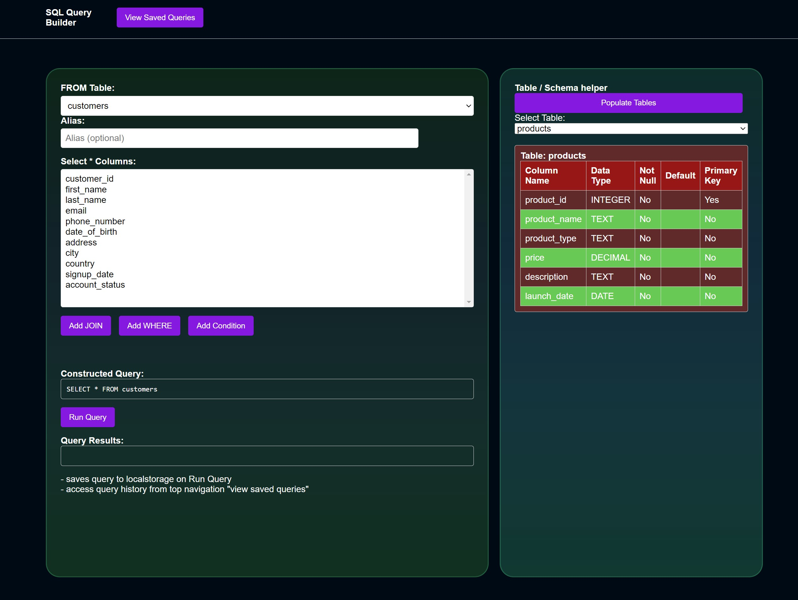
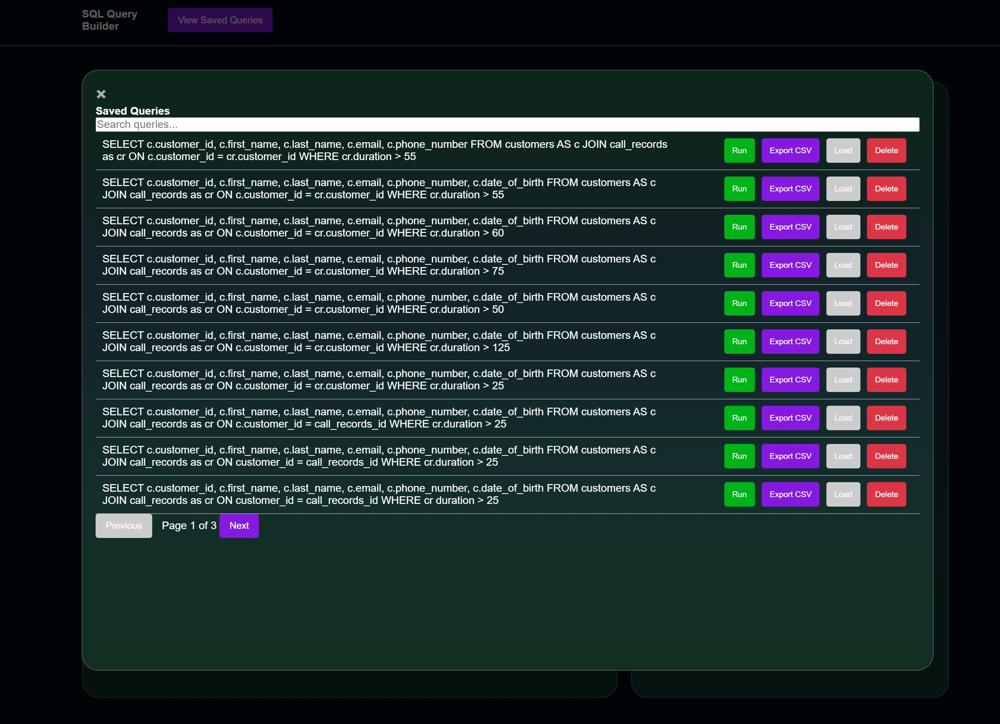

### TEST; SQL Query Builder / table analyser in Node.js / vanilla

### The main idea would be to connect it to any sql database and do stuff with it.

- definitely sounded easier in concept than it actually is while building it.
- good for a demo, or a tool to help people learn sql. would rewrite in typescript / react or something.
- has some python scripts to create a database and populate it with data.

### done
- resolve initial selected table not showing columns
- added user options and confirmation dialog

- add an interface, maybe tabbed, or nav bar

- add DISTINCT toggle
- add COUNT(*) toggle
- can add limit

- add option to select columns from joined tables ...

- on modal close, set searchbar to empty

- copy to clipboard button for query.

- export to csv button functions 

- expand on table analyser, more details, first few rows, etc

- clean up messy code and refactor, structure, and comments

- add an I'm a grown-up I can write my own SQL queries field ( or a checkbox so I can edit manually )

- build a migration tool to edit stuff
- query builder like

later:
- expand joins to dropdown multi joins.

### failed - meh - maybe at rebuild, design
- save the entire query state to local storage
- so we can load them later to an editable form